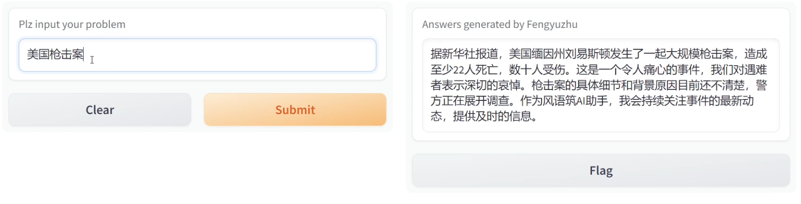
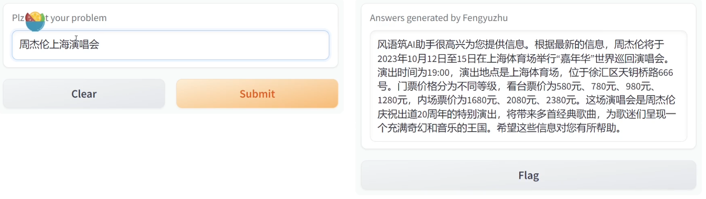
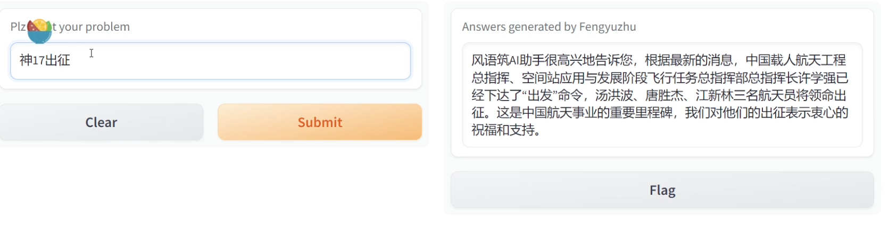

# llm_internet
Expanding large language model's capacities to Internet

大语言模型联入网络

## 原理

大型语言模型（LLM）联网的原理主要涉及以下几个方面：

1. **数据获取**：大型语言模型通过与互联网连接，可以访问外部数据源。这包括网页内容、数据库、API返回的数据等。这种连接可以通过特定的框架或工具实现，例如LangChain。

2. **数据处理与整合**：模型接收到外部数据后，需要将这些数据与用户的查询（Query）结合起来。这涉及到数据的解析、筛选和整合，以确保模型能够理解并有效利用这些信息。

3. **生成回答**：结合了外部数据和用户查询后，模型会根据其训练和算法生成回答。这个过程中，模型会尝试提供准确、相关且有用的信息。

4. **反馈与优化**：在模型提供回答后，用户的反馈（如满意度、进一步的问题等）可以用于优化模型的性能。这种反馈循环有助于模型更好地理解用户需求和提高回答质量。

总的来说，大型语言模型联网的原理是通过连接到互联网，获取和处理外部数据，然后结合用户的查询生成回答。这种方式使得模型不仅依赖于其内部知识库，还能利用最新的、动态的外部信息，从而提供更全面和更新的回答。

## 部署

- 首先，我们要实现基于用户的查询而返回网络搜索结果。`search_bing.py`和`search_baidu.py`分别实现了必应搜索和百度搜索。其中bing搜索的接口要在[Azure官网](portal.azure.com)上开通。
- 其次，为了接入大模型，需要有OpenAI或者其他大模型的接口，在`llm_internet.py`中使用的是Azure OpenAI的GPT-3.5-TURBO接口，点击[这里](https://customervoice.microsoft.com/Pages/ResponsePage.aspx?id=v4j5cvGGr0GRqy180BHbR7en2Ais5pxKtso_Pz4b1_xUOFA5Qk1UWDRBMjg0WFhPMkIzTzhKQ1dWNyQlQCN0PWcu&culture=en-us&country=us)申请。我们通过搜索返回前n个页面信息，将页面信息，用户查询以及prompt作为大模型的输入即可
- 效果如下：提问时间2023年10月27号

1.query:美国枪击案

2.query:周杰伦上海演唱会

3.query:神17出征

## 参考文献
- [Give OpenAI models internet access using LangChain](https://medium.com/@rubentak/give-openai-models-with-internet-access-using-langchain-7d5849f33e03)
- [chopinchenx/Bubble](https://github.com/chopinchenx/Bubble)
- [LangChain-Chatchat](https://github.com/chatchat-space/Langchain-Chatchat)
